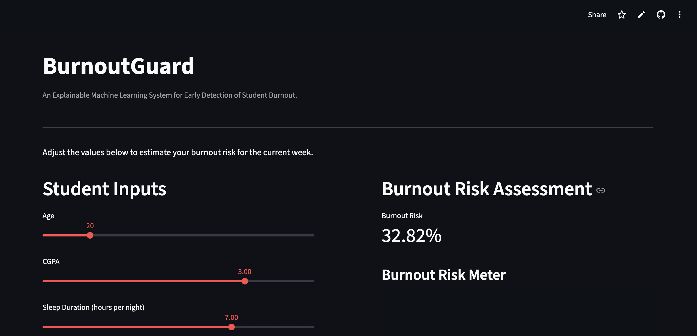

# BurnoutGuard

### Explainable Machine Learning System for Student Burnout Risk Detection

BurnoutGuard is an interactive machine learning application that predicts the risk of student burnout using behavioral and lifestyle indicators.

The system analyzes factors such as sleep duration, study hours, social media usage, physical activity, academic performance, and demographics to estimate burnout risk and explain the key contributors behind each prediction.

---

## Live Application

https://burnout-risk-predictor.streamlit.app/

---

## Application Preview

(Add your screenshots here)

Example:


/Users/rachanadutta/projects/burnout-risk-prediction/assets/Screenshot 2026-03-12 at 1.37.49 PM.png
/Users/rachanadutta/projects/burnout-risk-prediction/assets/Screenshot 2026-03-12 at 1.38.03 PM.png

---

## Project Motivation

Student burnout is increasingly common due to academic pressure, sleep deprivation, and unbalanced lifestyles.

This project demonstrates how machine learning can be used to:

• estimate burnout risk
• understand key factors driving burnout
• provide interpretable insights using Explainable AI

The goal is not only prediction, but also **interpretability**, helping users understand *why* the model predicts a certain risk level.

---

## Key Features

Interactive Streamlit web application

Real-time burnout risk prediction

Explainable AI using SHAP values

Feature contribution visualization for each prediction

Global feature importance analysis

Lifestyle balance score based on behavioral inputs

Model-driven recommendations to reduce burnout risk

---

## Machine Learning Workflow

The project follows a full ML pipeline:

1. Data collection and preprocessing
2. Exploratory Data Analysis (EDA)
3. Feature engineering
4. Model experimentation
5. Hyperparameter tuning
6. Model evaluation
7. Explainability with SHAP
8. Deployment with Streamlit

---

## Model Development

Multiple models were evaluated during experimentation:

• Logistic Regression
• Random Forest
• Gradient Boosting

Random Forest was selected as the final model because it captured nonlinear relationships between lifestyle features and burnout risk most effectively.

Evaluation metrics used:

• ROC-AUC Score
• Classification Report
• Train/Test validation

Final Model Performance:

ROC-AUC ≈ **0.88**

---

## Explainable AI (SHAP)

To improve transparency, SHAP (SHapley Additive Explanations) is used to interpret predictions.

For each prediction the system shows:

• top factors influencing burnout risk
• feature contribution visualization
• interpretable feature names after preprocessing

This allows users to understand which behavioral factors contribute most to burnout risk.

---

## Example Model Insights

Typical high-impact burnout drivers identified by the model:

• reduced sleep duration
• long study hours
• excessive social media usage
• low physical activity

---

## Tech Stack

Python

Scikit-learn

Streamlit

SHAP

Pandas

NumPy

Matplotlib

Plotly

---

## Project Structure

```
burnout-risk-prediction
│
├── app
│   └── app.py
│
├── data
│   ├── raw
│   │   └── student_lifestyle.csv
│   │
│   └── processed
│       └── clean_student_lifestyle.csv
│
├── models
│   └── burnout_model.pkl
│
├── notebooks
│   ├── eda.ipynb
│   └── experiment.ipynb
│
├── src
│   ├── __init__.py
│   ├── data_preprocessing.py
│   ├── predict.py
│   └── train.py
│
├── assets
│   └── app_screenshot.png
│
├── requirements.txt
└── README.md
```

---

## Running the Project Locally

Clone the repository

```
git clone https://github.com/YOUR_USERNAME/burnout-risk-prediction.git
```

Navigate into the project

```
cd burnout-risk-prediction
```

Install dependencies

```
pip install -r requirements.txt
```

Run the Streamlit application

```
streamlit run app/app.py
```

---

## Dataset

The model was trained on **100,000 student lifestyle records** containing behavioral and demographic attributes.

Key features include:

Age
CGPA
Sleep Duration
Study Hours
Social Media Usage
Physical Activity
Gender
Department

---

## Disclaimer

This tool estimates behavioral burnout risk and is intended for educational and research purposes only.
It does not provide medical or psychological diagnosis.

---

## Author

Rachana Dutta
BTech Computer Science

